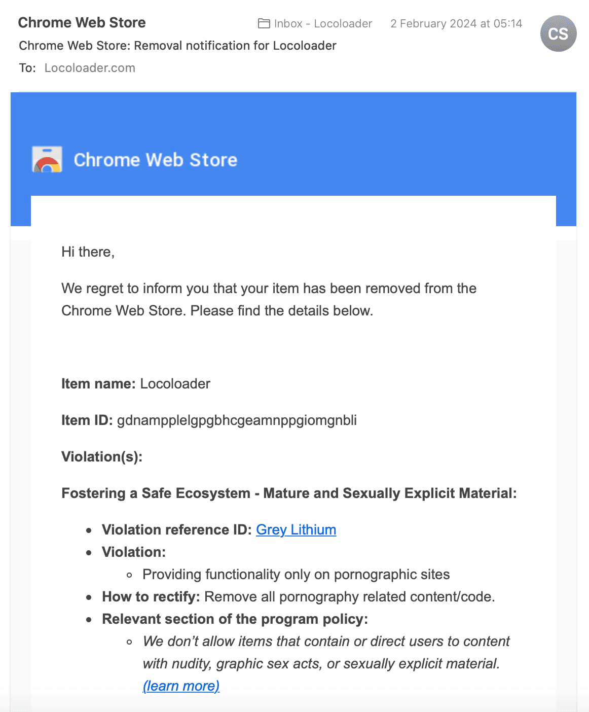

# Locoloader Chrome Extension

### :hammer_and_wrench: Installation
1. Download this extension as a [ZIP file from GitHub](https://github.com/locoloader/chrome-extension/archive/refs/heads/main.zip)
2. Unzip the file and you should have a folder named `chrome-extension-main`
3. Visit the URL `chrome://extensions` and enable `Developer mode`
4. Drag and drop the `chrome-extension-main` folder anywhere onto the extensions page to install it (do not delete the folder afterwards)

:bulb: If you don't want to install the extension from source, you can still use our [Firefox extension](https://addons.mozilla.org/en-US/firefox/addon/locoloader/).

### :hammer_and_wrench: Update
1. Visit the URL `chrome://extensions`
2. Remove the Locoloader extension
3. Follow the [installation steps](#hammer_and_wrench-installation) 

### :thinking: Why not from the Chrome Web Store?
This extension has been in the Chrome Web Store for almost 4 years and has been installed by more than 100k+ users. Unfortunately, it has been removed from the store due to its potential use with adult content.

### :thinking: Is it safe?
We have open-sourced the Locoloader extension and anyone can take a look at the source code for full transparency. If you discover a security vulnerability, please send an e-mail to [info@locoloader.com](mailto:info@locoloader.com).  

### MIT License
Copyright (c) 2024 Locoloader.com

Permission is hereby granted, free of charge, to any person obtaining a copy of this software and associated documentation files (the "Software"), to deal in the Software without restriction, including without limitation the rights to use, copy, modify, merge, publish, distribute, sublicense, and/or sell copies of the Software, and to permit persons to whom the Software is furnished to do so, subject to the following conditions:

The above copyright notice and this permission notice shall be included in all copies or substantial portions of the Software.

THE SOFTWARE IS PROVIDED "AS IS", WITHOUT WARRANTY OF ANY KIND, EXPRESS OR IMPLIED, INCLUDING BUT NOT LIMITED TO THE WARRANTIES OF MERCHANTABILITY, FITNESS FOR A PARTICULAR PURPOSE AND NONINFRINGEMENT. IN NO EVENT SHALL THE AUTHORS OR COPYRIGHT HOLDERS BE LIABLE FOR ANY CLAIM, DAMAGES OR OTHER LIABILITY, WHETHER IN AN ACTION OF CONTRACT, TORT OR OTHERWISE, ARISING FROM, OUT OF OR IN CONNECTION WITH THE SOFTWARE OR THE USE OR OTHER DEALINGS IN THE SOFTWARE.