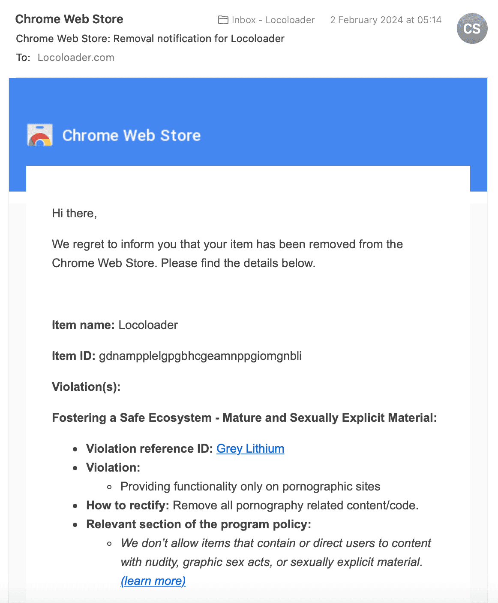

# Locoloader Chrome Extension

### 🛠️ Installation
1. Click [here](https://github.com/locoloader/chrome-extension/archive/refs/heads/main.zip) to download the Locoloader extension from GitHub.
2. Extract (unzip) the downloaded file. This will create a folder named `chrome-extension-main`. Do not delete or move this folder after installation, because the extension runs directly from it.
3. Open the address `chrome://extensions` in your Chrome browser and turn on the `Developer mode` switch in the top-right corner.
4. Drag and drop the `chrome-extension-main` folder anywhere onto the extensions page to install it. Note that Windows may double the folder like this: `chrome-extension-main\chrome-extension-main`. If this happens, drag and drop only the inner folder into Chrome. If you use the outer folder, the installation will fail.

### 💡 Installation Tips
- Before you drag and drop the extension folder into Chrome, move the folder out of your `Downloads` folder. This ensures you won't accidentally delete it later when clearing out other downloaded files.
- If you prefer not to install the extension from source, you can still use our [Firefox extension](https://addons.mozilla.org/en-US/firefox/addon/locoloader/).

### ⚙️ Settings
1. Open the address `chrome://extensions` in your Chrome browser.
2. Find the Locoloader extension and click the `Details` button.
3. If you use Incognito Windows, turn on the `Allow in Incognito` switch.

### ⬆️ Update
1. Open the address `chrome://extensions` in your Chrome browser.
2. Remove the Locoloader extension.
3. Follow the [installation steps](#installation).

Windows may extract (unzip) the extension into a nested `chrome-extension-main\chrome-extension-main` folder instead of just a single `chrome-extension-main folder`. If this happens, make sure you drag and drop the inner chrome-extension-main folder, otherwise the installation will fail.

### 🤔 Why isn't this on the Chrome Web Store?
This extension was in the Chrome Web Store for nearly 4 years and was installed by more than 100k+ users. Unfortunately, it was removed from the store due to its potential use with adult content.

### 🤔 Is it safe?
We made the Locoloader extension open-source so anyone can look at the code for full transparency. If you find a security bug, please let us know at [info@locoloader.com](mailto:info@locoloader.com).

### MIT License
Copyright (c) 2026 Locoloader.com

Permission is hereby granted, free of charge, to any person obtaining a copy of this software and associated documentation files (the "Software"), to deal in the Software without restriction, including without limitation the rights to use, copy, modify, merge, publish, distribute, sublicense, and/or sell copies of the Software, and to permit persons to whom the Software is furnished to do so, subject to the following conditions:

The above copyright notice and this permission notice shall be included in all copies or substantial portions of the Software.

THE SOFTWARE IS PROVIDED "AS IS", WITHOUT WARRANTY OF ANY KIND, EXPRESS OR IMPLIED, INCLUDING BUT NOT LIMITED TO THE WARRANTIES OF MERCHANTABILITY, FITNESS FOR A PARTICULAR PURPOSE AND NONINFRINGEMENT. IN NO EVENT SHALL THE AUTHORS OR COPYRIGHT HOLDERS BE LIABLE FOR ANY CLAIM, DAMAGES OR OTHER LIABILITY, WHETHER IN AN ACTION OF CONTRACT, TORT OR OTHERWISE, ARISING FROM, OUT OF OR IN CONNECTION WITH THE SOFTWARE OR THE USE OR OTHER DEALINGS IN THE SOFTWARE.